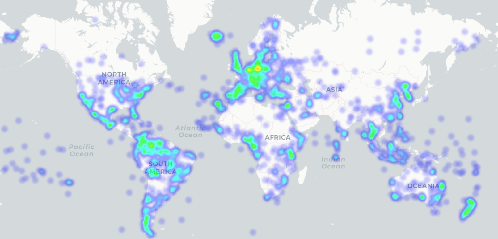
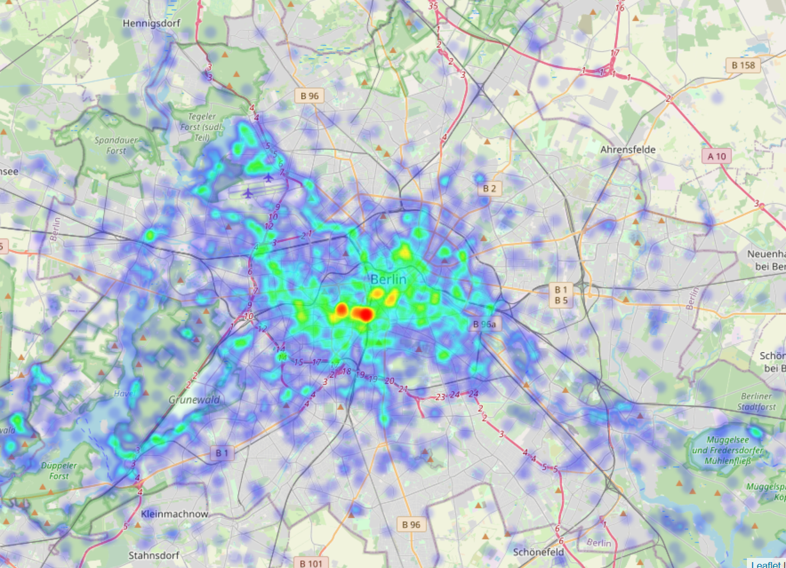

# Geo_heatmap

This is a repository for teaching data science students how to get the location data from google and use it to make a geo heatmap with folium.
This repository is a simplifyed student-friendly version of the repository created by luka1199 https://github.com/luka1199/geo-heatmap with some added gimnicks ;-) 
(Including a new script for handling google maps search history files)

You need Python 3.8 or higher and jupyter notebook for this repository

### 1. Get Your Location Data

Here you can find out how to download your Google data: <https://support.google.com/accounts/answer/3024190?hl=en> 
Here you can download all of the data that Google has stored on you: <https://takeout.google.com/>
Make sure you select to download your location data as a .json file!

As an alternative, you can also download from <https://takeout.google.com/> under 'My Activity' your google maps search history as a .json file and use it for the Geo_heatmap

### 2. Create your own Geo_Heatmap 

After you get your location history from google, replace the Location_History.json file with your own Location History file.

If you want to use the 'My Activity' json maps search history file, load it into the main folder of this repository as My_Activity.json

In your bash terminal, install the requirements:

	pip install -r requirements.txt

run the jupyter notebook script geoheatmap_students.ipynb (for the location history file) or the script geo_heatmap_Mapsearch.ipynb (for the map search history file)

Yor maps will be displyed and stored a .html files

To protect your privacy: Do not push your own .json files or .html output files to this repository!

### 3. Host your Geo_Heatmap as a website on GitHub

Create an empty repository on Github and clone it

Rename your resulting map html file index.html and save it in the repository

Push the changed repository to Github

On the Settings page of your GitHub respository go to 'GitHub pages'

Choose 'master branch' as the source and 'Cayman' as the theme

Your map will then be available as a website as https://{your GitHub user name}.github.io/{your repository name}/ 

### Example for a location history Geo_heatmap

### Example for a world search history Geo_heatmap

### Zoomed in example for a search history Geo_heatmap

